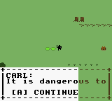
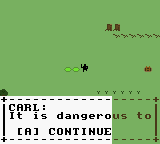
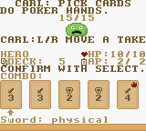
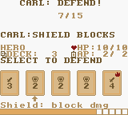
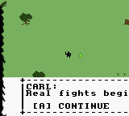

# How to Fight — Combat Tutorial

This is the player's guide to battles. Numbers below match the game
(`docs/technical-manual.md` §6/§8 is the authoritative spec); the
in-game TUTORIAL slides (title menu) are the pocket summary of this page.

## The goal

Reduce every enemy's HP to 0 before yours reaches 0. Most fights are
against a **trio** of monsters (clones of one type); bosses fight alone.
You always strike first each round, then block.

## First spar: Carl

The field holds a single slime, **CARL**, in a grove of trees, old
stumps and grass tufts. Walk into him and a dialogue box opens first:
it is dangerous to go alone, and he will teach you how to fight. Then
bump his sparring spot beside him and the fight starts.



East of him sits a treasure chest with your first POISON_DAGGER (the
starter deck carries none); the Merchant sells more.

He is a friendly practice dummy whose every word is green, so you know
it is him speaking.



Walk into him to spar: a solo fight against his 15 HP. His practice
deck deals **0 damage**, so you cannot lose — learn the round below at
your own pace (the battle timer still runs, but nothing can hurt you).
There is no target arrow over Carl: with a single foe there is nothing
to aim at. On your turn the top reads `CARL: PICK CARDS`, then
`DO POKER HANDS.` below it.



On his turn he coaches the block (`SHIELD` cards stop his swing,
`SELECT` defends).



Beat him and he wishes you luck: your energy pool grows from **2 to
3 AP** per phase for every later battle.



## One round, step by step

```
1. PLAY YOUR ATTACK  -- pick up to 5 cards, press SELECT
2. Watch it land     -- damage or healing resolves
3. ENEMY TELEGRAPH: the foe shows its card,
   its value is the damage coming at you
4. DEFEND            -- play shields to block that damage
5. Resolve, refill, next round
```

## Controls

| Button | Action |
|---|---|
| `LEFT` / `RIGHT` | Move the hand cursor |
| `UP` / `DOWN` | Change target (matters vs trios; the `^` caret marks it) |
| `A` | Select the hovered card into your combo |
| `B` | Undo last selection. With **nothing selected in the attack phase**, `B` **flees** |
| `SELECT` | **Execute** the current selection |
| `START` | Quick screen (pauses battle, resumes where you left off) |

Selected cards show digits 1-5 in the order you picked them. Order
matters only for one thing: the **first (leading) card** decides what an
attack *does* (see below).

## Hand, energy, timer

- **Hand**: 5 cards, drawn from your deck. Played cards are discarded
  and replaced at the round boundary.
- **Energy**: **2 per phase** at first — attack *and* defend each get a
  fresh pool. Beating Carl's practice spar raises it to **3 per phase**.
  Every card shows a cost; selecting reserves it, resolving pays it.
  A card you can't afford can't be selected (`NO ENERGY!`).
- **Timer**: **20 seconds** per decision, shown as the bottom bar. Expiry
  auto-executes whatever you selected (or auto-picks the hovered card if
  you picked nothing and something is playable). It never runs during
  animations.

## Attacking: cards + combos

Each card has a **value** (its power) and a **symbol** (its type):

| Card | Attack does | Defend does |
|---|---|---|
| `SW` Sword | damage | nothing (0) |
| `BO` Bow | damage | nothing (0) |
| `DA` Dagger | damage (may poison) | nothing (0) |
| `SH` Shield | **0 damage** — but counts for combos | **blocks** its value |
| `HE` Heal (rings) | heals (see below) | blocks like a shield |

Your selection ranks **like a poker hand**. Better hands multiply the
whole play:

| Hand | Needs | Multiplier |
|---|---|---|
| high card | anything / 1 card | 100% |
| PAIR | 2 same value | 120% |
| TWO PAIR | 2 pairs | 150% |
| THREE KIND | 3 same value | 180% |
| STRAIGHT | all 5 sequential | 210% |
| FLUSH | all 5 same symbol | 240% |
| FULL HOUSE | trips + pair | 260% |
| FOUR KIND | 4 same value | 280% |
| STR FLUSH | 5 sequential, same symbol | 350% |
| FIVE KIND | all 5 same value | 400% |

Same-symbol hands get **+25%** on top. Final effect, always rounded
down: `base × multiplier / 100`.

The **leading card** decides the action:

- **Sword/bow/dagger lead** → damage. Base = sum of the
  non-shield, non-ring values. Shields in the mix add 0 damage but
  still shape the hand — `SW1 SH2 SW3` is a straight (×150%) on a base
  of just `1 + 3 = 4`, dealing 6.
- **Ring (`HE`) lead** → heal instead of damage. You gain the whole
  hand's scaled power **plus** the ring's own value. Put the ring
  *second* if you want the swords to hit and the ring to just top you up.
- **Shield lead** → still deals the non-shield damage sum (shields are
  "fodder that counts"). Only a ring lead turns an attack into a heal.

Worked example: `SW3 + SW3` is a PAIR — base 6 × 120% = **7 damage**.

The COMBO row above your hand previews the tier live as you select.
Playing junk that makes nothing still **eats the cards** — a lone `SH2`
on attack does 0 and is gone. That trade (burn a shield for a bigger
attack now vs save it to block next) is the core decision of the game.

## Defending

After the telegraph (`ENEMY ATTACK!`, e.g. damage 3), only **shields**
(and rings) do anything. Swords, bows, daggers, played here are fully
inert — 0 block, 0 combo — though the game still lets you select them
(and still eats them, so don't).

```
net = incoming - (shields + rings)
net > 0  -> you take that much
net <= 0 -> no damage; over-block heals you ONLY with a ring in the mix
```

Worked example: incoming 3, you play `SH2` → take **1**.

## Rings and healing

Rings (`HE`) are the game's healing vector — the shopkeeper sells an
iron ring, and loot can contain more:

- In **attack**, a ring is a **joker**: any value 1-10, best tier kept.
  It deals 0 damage itself and heals its power on resolve.
  Example: `SW5 + RING2` reads as a PAIR of fives — 5 × 120% = **6
  damage dealt**, plus **2 HP healed**.
- In **defend**, a ring is a **wild shield** worth its power, counting
  for block *and* for pairs/straights.
- **Max one ring per selection** — a second attempt flashes `ONE RING!`.

## Status effects

| Status | Does | From |
|---|---|---|
| POISON | 1 HP/round **and greys out 2 of your hand cards** for 2 rounds | poison daggers, bat/spider swings |
| BURN | 1 HP/round | fire swords |
| FREEZE | you skip your whole action (attack *and* the incoming block); enemies skip their swing | ice swords |

Greyed cards can't be selected (cursor skips them). Re-poisoning
refreshes the duration, not which cards are grey. Failed applications
show as resisted.

## Enemies and their decks

Each enemy draws **one card per attack turn**; the card's value is the
damage you must block (announced up front, so defending is never a
guess). Rough guide: slimes hit 2-3, bats up to 4 (one swing poisons),
kobolds 2-3, spiders up to 3 (one webs/poisons), the mimic 2-4,
trios hit 2-3 per round, the deckless boss swings a flat 3. Exhausted
enemy decks cycle.

## Running out of cards

Cards have **uses per battle** (unlimited ones never run out); a spent
card stays in your deck but can't be played (`OUT OF USES!`). When the
draw pile can't refill your hand, the game spends that round
**reshuffling** the discards back in — the enemy still attacks that
round, so don't get caught empty-handed.

## Winning, losing, running

- **Victory**: all enemies down. Fanfare, a loot card reveal (`YOU
  FOUND:` — exactly one card per victory), gold (slimes 5, bats 8,
  kobolds 8, spiders 15, boss 50), HP carries into the overworld, the
  monster stays dead.
- **Defeat**: HP 0 → Game Over screen.
- **Flee**: `B` with an empty selection in the attack phase. No reward,
  the enemy survives. (No fleeing mid-defend — weather the hit first.)
